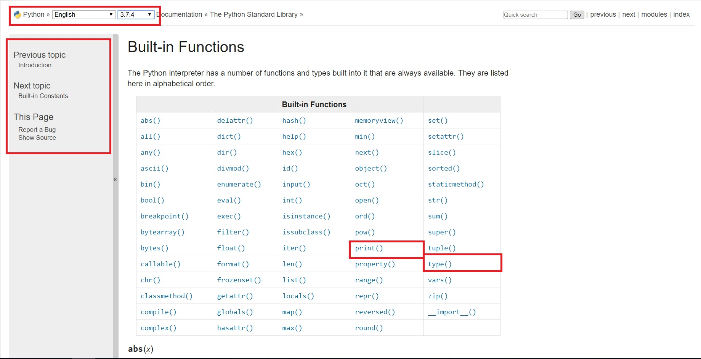
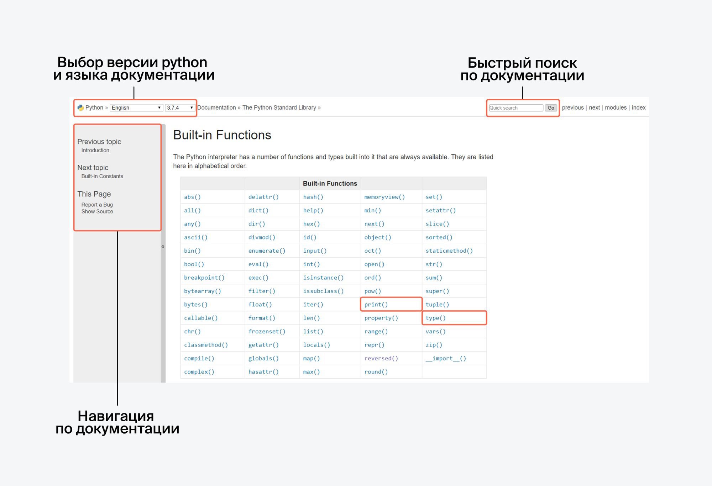

# Как работать с документацией

У каждого языка программирования есть документация — описание его
структуры и функций. «Дока» (документация на жаргоне) обычно есть в
открытом доступе.

Когда вы сталкиваетесь с ошибкой в коде и не понимаете, в чём дело, — самое
время посмотреть в доку. Она бывает сложна для восприятия.

Документацию к интересующему вас языку программирования можно найти
набрав в поисковой строке, например, "python документация".

Например, вы хотите больше узнать про функцию len(). Наберите поисковый
запрос "python функция len() документация" и посмотрите на первую ссылку.
Скорее всего это будет ссылка на официальную документацию языка -
https://docs.python.org/3/library/functions.html.

Посмотрим внимательно на составляющие страницы

---

Как определить, что это официальная документация? Сложно выделить общие
черты, но если вы посмотрите, на документацию языка python и библиотеки
pandas, то обратите внимание, на похожие домены и принципы
структурирования информации.

Старайтесь выбирать сайты с официальной документацией — это гарантирует,
что информация будет без ошибок.

Когда нет возможности найти что-то быстро в документации, можно
воспользоваться сайтами, где другие пользователи задают вопросы про
различные сложности в коде. Один из таких сайтов - stackoverflow. Он есть на
русском и английском языках. Часто в качестве ответа вы сможете там найти
кусок рабочего кода. Как бы не хотелось его использовать немедленно в своём
решении, сначала проверьте правильно ли он решает вашу задачу и понимаете
ли как он делает это. Если этот код останется для вас чёрным ящиком, то через
какое-то время нужно будет вспоминать как его реализовать.

Кроме того, вы можете обратиться к github — своего рода хранилищу кода.
Здесь разработчики со всего мира выкладывают решения различных задач, а
если повезёт - подробно описывают как получили решение. С этими
решениями нужно быть таким же осторожным, как и с решениями с сайта
stackoverflow:
* проверьте, понимаете ли вы все методы, которые используются в этом коде
* проверьте, решает ли этот код вашу задачу правильно

Смотреть на работу других разработчиков (особенно в открытом доступе) —
это нормально и полезно для расширения знаний и кругозора. Если
документация и другие сайты не помогли в ответе на поставленный вопрос,
теперь можно задать вопрос коллеге или руководителю.

