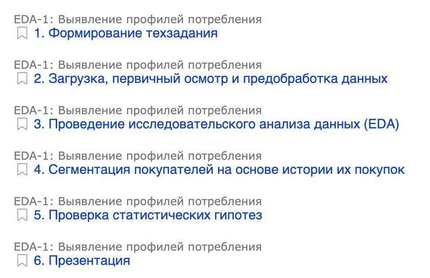
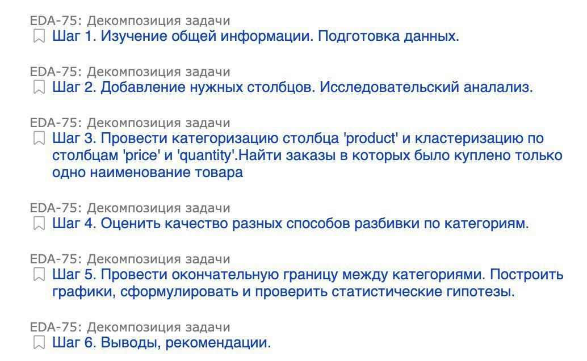

# Декомпозиция аналитической задачи

> Любая задача прилетает аналитику «сырой», в самой общей
> форме. Пытаясь решить её с наскока, вы рискуете совершить
> логические ошибкам, неверное обработать данные и даже
> упустить из виду важные части задачи. Нужно делить её на
> блоки, а те на подзадачи. Это называется декомпозиция, и ей
> тоже стоит научиться.

В проектах учебной программы мы декомпозировали задачи за вас. Сейчас вам
предстоит сделать это самостоятельно:

1. Вместе с заказчиком выработайте образ конечного результата
   * Например, «на основе персональных данных сформировать список
пользователей, которым надо отказать в кредите».
   * Конкретизируйте форму представления результата: таблица, график,
презентация или что-то другое. Всё, что касается заказчиков, обычно
происходит и может потребовать нескольких итераций. Будьте терпеливы и
настроены на сотрудничество, не отчаивайтесь после первых
безрезультатных переговоров.

2. Выделите этапы решения
   * Какие шаги приведут вас к желаемому результату? Каждый этап должен
иметь **один** конечный результат, например:
     * выгрузка данных;
     * график;
     * алгоритм.

3. Вы можете предварительно визуализировать декомпозицию в виде:
   * блок-схемы;
   * майнд-карты.

4. Проверьте себя. Если вы успешно завершите каждый из описанных шагов,
получите ли вы заранее определённый конечный результат?

---

В трекере можете группировать похожие задачи. Например, «Знакомство
с данными», «Предобработка», «Исследовательский анализ данных».

Не создавайте по задаче на каждый мелкий шаг: "Открыть Jupyter Notebook",
"вызвать функцию print()". Изучите, как были сформулированы шаги в учебных
проектах. Объединяйте мелкие действия наподобие «Избавиться от пропусков»
и «Нормализовать данные» в одну задачу «Предобработка».

Вот неудачный пример декомпозиции задачи:

---

Теперь приведём пару удачных примеров. Это первый:

---

Второй, более детальный:

