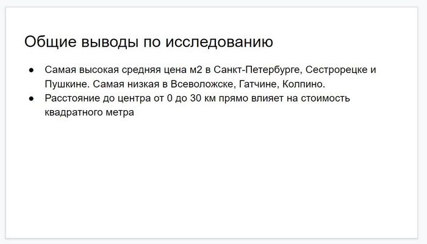
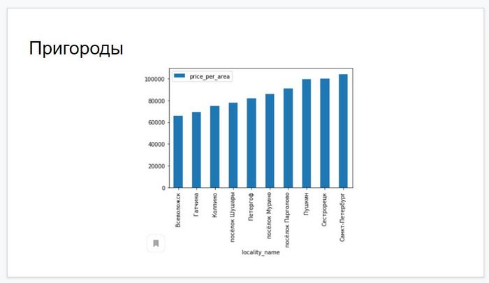
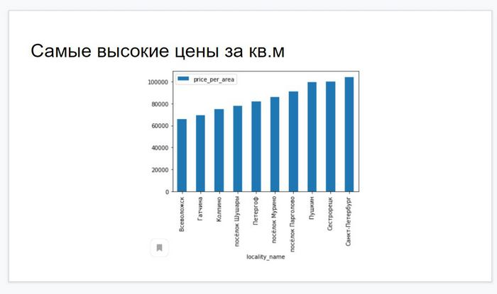
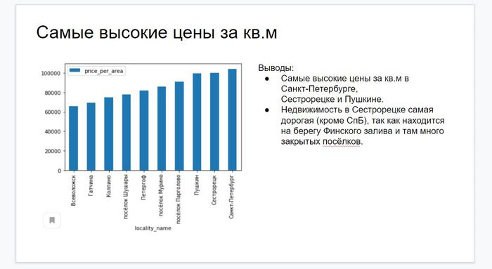

# Подготовка презентации

**Аудитория**

Важно понимать, кто будет изучать результаты вашего исследования.
Например, если это:

* аналитики
  * Подготовьте подробный отчёт с кодом, комментариями к нему и ссылкой на
данные. Лучше собрать его в Jupyter Notebook. Уточните, что именно хотят
увидеть коллеги: методику расчёта или результаты с объяснениями. Это
поможет скорректировать ваш отчёт.
* менеджеры продукта
  * Подготовьте подробный отчёт в формате презентации: pptx или pdf.
Отразите основные результаты, выводы по ним и ваши рекомендации.
* руководители высшего звена 
  * Отчёт должен содержать ответы на конкретные вопросы руководителя.
Например, финансовому директору важнее будут «денежные» метрики.

Чтобы определиться, какую информацию добавить, а какую — отсечь,
руководствуйтесь правилом: чем пользователь презентации дальше от
анализа данных, тем проще она должна быть. Не погружайте руководителя
компании в детали вашей борьбы с пропусками. Хотя он и обрадуется, что вы
такой профессионал, не отнимайте его время. Пусть концентрируется на
важном.

Когда вы провели исследование, сделали выводы и построили графики —
можно собирать финальную презентацию.

---

**Инструменты**

Пользователи Windows создают презентации в Power Point. Это платное
программное обеспечение из пакета программ Microsoft Office. Альтернативой
может стать Power Point Online или Libre Office. У владельцев MacOS есть Key
Note.

Презентацию делают в двух основных форматах: pptx (формат Power Point) и
pdf.

Если над ней работают в команде или она нужна для внутреннего пользования,
сохраните презентацию как pptx.

Если вы готовитесь к выступлению, сохраните файл в формате pdf. Тогда стили,
шрифты и картинки отобразятся как задумано. Ещё pdf можно открыть почти с
любого устройства, а с pptx такое получается не всегда.

---

**Структура презентации**

В курсе «Исследовательский анализ данных» вы провели анализ рынка
недвижимости в Санкт-Петербурге. Разберём, как можно оформить
презентацию.

1. На вводном слайде укажите предмет и период исследования.

---

2. Общие выводы — в начало.  

---

## Далее будем от шага к шагу улучшать один слайд.

3. Один слайд — одна мысль.
Всё, что непонятно, смело убирайте.

---

4. В заголовке слайда — ключевой вывод.
Не до конца понятно, что значит «Пригороды». Укажите в заголовке вывод,
который укажет, на что нужно обратить внимание и ответ на какой вопрос
искать на слайде.

---

5. Укажите выводы исследования.
Убедитесь, что вы не допустили грамматических и пунктуационных ошибок.

---

6. Поддерживайте единую историю.
Решайте задачи исследования постепенно. Завершайте каждый блок
слайдов так, чтобы пользователи презентации делали нужные выводы.

---

7. Убедитесь, что данные корректны.
Проверьте, что графики не противоречат друг другу.

---

8. Указывайте источники данных.  

---

9. В конце презентации — рекомендации.
Необязательно подробные, но отражающие суть.

---

В компании скорее всего есть гайдлайн (шаблон) по оформлению презентаций,
где указаны все нюансы и требования. Уточните это у своих коллег.

